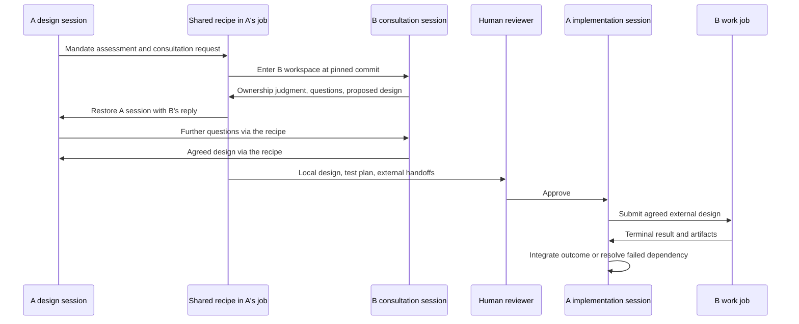

# Cross-cell conversations during design and implementation

Status: implemented by `recipes/develop/design.yaml`, `implement.yaml`, and the
shared `consultation-turn.yaml` / `consult.yaml` recipes, using
c2j node workspaces. This replaces the earlier proposal for a new session op.
Compilers and workers must both support `workspace` and its resolution task.
Production handoffs also require the runtime fixes listed below.

## Execution model

A cell defines responsibility, a job owns execution, and a session holds a
conversation. Cell A's job can host a separate Codex session grounded in cell B's
repository, instructions and mandate. Discussion does not create a B job.
Actual B implementation still requires a B job.



During a consultation:

| Context | Value |
|---|---|
| `context.workflow.cell` and current-job broker provenance | A |
| `context.workspace.cell`, `context.git.*`, worktree and instructions | B |
| Recipe source and execution ownership | A's existing job |
| Conversation | Separate B session; never A's session ID or checkpoint |
| Git propagation | No adoption of B's snapshot by A |

The shared turn’s `consult` node declares `workspace: {cell: ..., ref: ...}`. Each invocation
creates a fresh logical workspace. The first ref is explicit (normally `main`);
subsequent turns use the recorded full commit, even if B's upstream moves. Recipe
includes retain their original source. The consultation checks for the runtime's
workspace scope ID; an ignored declaration cannot silently run as an ordinary A
operation. Repository resolution/access failures stop execution without fallback.

## Mandate and dialogue contracts

A reads its accepted `.c2j/mandate.md` at the job's initial commit, independently
of `target_directory`. Build and evolve use the same mandate. Each design turn
returns a structured assessment of every requested outcome. The contract checks
unique IDs, clause references, the fits/partial/outside verdict, and the exact
allocation of local requirement IDs. Independent design review judges whether
the assessment faithfully covers the user's request and actual responsibilities.
See [the mandate specification](CELL_MANDATE_SPEC.md).

A can request one consultation per turn:

```json
{
  "thread_id": "service-pagination",
  "cell": "github.com/example/service",
  "ref": "main",
  "message": "Proposed interface and acceptance outcomes; questions for the service owner."
}
```

The recipe runs B, adds its response to the thread's history, and resumes A.
A can answer questions, refine the proposal and request another turn using the
same thread ID, cell selector and original ref. Changing a thread's cell/ref is
rejected; use a new thread for a different context. Multiple threads can discuss
different cells sequentially. Each design or implementation pass allows eight consultation turns;
exhaustion returns a clarification question. Human feedback starts another pass
while retaining the earlier discussions and their pinned commits.

B writes a schema-validated response containing `status`, `fit`, `summary`,
`questions`, `blocking_issues`, and `design_markdown`. It reads B's mandate and
AGENTS instructions. Missing/invalid mandates cannot yield a ready response.
Missing sessions, invalid artifacts, incomplete execution and attempted child
submissions cannot be accepted as a valid consultation.

## Disposable code, durable conversation

The B Codex op uses `const: true`. Local experiments are allowed, but do not
advance the workspace snapshot. Each later turn starts from the pinned commit;
no experimental checkout is reused or merged. Explicit pushing/merging is
forbidden by the consultation instructions, not by a new filesystem security
boundary. Workspace isolation does not itself revoke Git publishing credentials.

The recipe restores Codex's `codex-home-state` artifact at its expected inbox
location. The ledger records each thread's session ID, checkpoint references,
commit, mandate provenance and message/response pairs. Only session checkpoint
artifacts are forwarded into later B turns; experimental diffs/thin packs are
not. A's checkpoint is filtered to the same session-only artifact names and
restored separately. Phase context and result bindings select their named JSON
files so an incidental Git thin pack cannot become a duplicate workspace restore.
A's candidate propagates through c2j's Git state, independently of checkpoints.

The durable design artifacts are `mandate-assessment.json`, `design.md`,
`consultations.json`, and `handoffs.json`. These capture the discussion and
reviewed outcome; they are not implicitly approved implementation patches.

## Discoveries during implementation

Implementation uses the same structured `consultation` request and shared turn
executor as design. A can describe a newly discovered dependency bug, provide
reproduction evidence, ask about an existing interface, and answer B's questions
without leaving its coding session. Its local candidate and dependency ledger
survive each foreign turn. Threads from design are available immediately; human
feedback and redesign merge the most advanced consistent history for each thread.
Different cells/refs/sessions or divergent message histories cannot be merged.

When advice resolves the problem within the approved plan, A resumes implementation.
When B must change, A returns `proposed_handoffs` with B's exact latest agreed brief.
The contract validates agreement and provenance and forces `status: redesign` for
new or changed work, even if the model reported ready. The coordinator supplies
that result and the updated ledger to design, then repeats design/test-plan review
and human approval. A previously approved unchanged handoff may proceed without
another approval. Discussions never authorize submission on their own.

Implementation emits `proposed-handoffs.json` and `consultations.json`; approved
work still uses design's `handoffs.json`. Failed or cancelled child outcomes remain
in A's dependency context during any further consultation and recovery.

## Handoff to actual work

For each external change, A proposes a handoff containing the thread ID, target
cell, build/evolve mode, original outcome IDs and B's exact agreed
`design_markdown`. Supporting dependencies may have no original outcome IDs.
The gate requires the latest B response to be ready, fit B's mandate, and have
no open questions/issues. It adds B's canonical identity, pinned commit and
mandate hash as provenance. A partial request must account for every external
outcome exactly once; local requirements alone enter A's test plan.

The human design/test-plan approval shows both the local/external split and
these handoffs. Only implementation may then submit actual child work with
`c2j submit --cell ... --build` or `--evolve`, including the reviewed brief and
provenance in the child prompt. The implementation session reconciles already
submitted handoffs using its dependency ledger. The usual `jobs.job_ids`
capture and terminal-result wait resume that session for success, failure,
cancellation or unmerged results. New or changed external scope returns `status: redesign`, which re-enters
design and requires a new approval. Specification and quality reviewers receive
the implementation dependency ledger and child artifacts. A submission attempt is not proof of successful completion.

B's new job starts a fresh work session and reassesses its **current** mandate.
Native adoption of the consultation session into B's job is not implemented;
the reviewed brief and provenance are its portable context. Child completion
does not automatically refresh A's Git snapshot or merge either cell.

An outside request presents routing/design advice for acknowledgment or revision,
then completes with `disposition: outside`, `merged: false`. It does not start
local implementation or implicitly launch jobs for the suggested owners.

## Verification

`recipe-tests/verify-consultations.py` exercises mandate provenance and invalid
assessments, routing in both defaults, real schema gates, and a deterministic
A/B/A/B/A dialogue using an independent in-memory JobDB service and real c2j
workers. It verifies separate sessions, portable checkpoints, a moving B branch,
discarded B experiments, restored A context, absence of consultation jobs, and later submission of the agreed brief to a real
child job.
No model API or home-sourced database is used. Model judgment and explicit
publishing restraint remain prompt/review responsibilities.

The current runtime also has a [child-broker include decoding bug](BUG_REPORT_CHILD_BROKER_COMPILED_INCLUDES.md).
The handoff integration fixture is inline; brokered production defaults with
compiled includes require the c2j fix. The [nested JSON issue](BUG_REPORT_NESTED_CEL_JSON.md)
has a recipe-side transport workaround.

The combined dialogue/child-wait test additionally exposes a
[workspace replay failure](BUG_REPORT_WORKSPACE_DIALOGUE_CHILD_WAIT_REPLAY.md)
when a replacement worker resumes the parent. It remains a failing regression;
the passing dialogue test alone does not establish durable end-to-end handoff.

`recipe-tests/verify-implementation-consultations.py` adds live late-discovery
coverage using the same separate ephemeral JobDB and real command/schema/workspace
execution. Cases exercise advice, multi-turn bug refinement, evolve's `.c2j` scope,
multiple foreign cells, design-session reuse, feedback resumption, failed dependency
history, missing mandates, outside ownership, malformed replies, missing/replaced
sessions, missing checkpoints, unavailable repositories, and the eight-turn limit.
It also tests agreement/provenance gates and conflicting history merges directly.
Only model invocations are replaced; model and sandbox quality require separate
live evaluation. All suites and both known runtime regressions are attempted even
when an earlier test fails.
