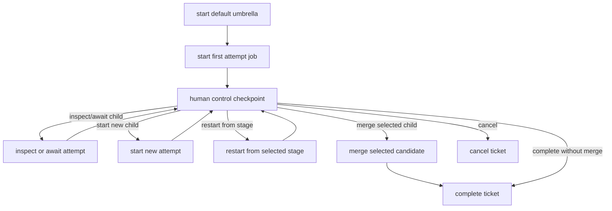

# Default Umbrella Job Model

## Purpose

This document sketches a `default` recipe model where the primary job is an
auditable ticket supervisor, not a single attempt to complete the ticket.

The goal is to make the default job complete only when the ticket outcome is
actually decided: merged, intentionally closed without merge, reassigned, or
cancelled. Child jobs can fail, be restarted, or be superseded without making
the default job fail prematurely.

## Problem

In a mostly automated system, the distinction between tickets and jobs gets
confusing:

- A ticket is the durable unit of requested work.
- A job is one execution of a workflow.
- A single ticket may need several jobs before it reaches a true outcome.

If the recipe attached to a ticket is also the implementation attempt, then an
infrastructure failure, bad plan, validation failure, or partial agent failure
looks like ticket failure. That is often wrong. It only means one attempt did not
produce an accepted outcome.

The `default` recipe should therefore behave more like a container job:

- It owns the ticket lifecycle.
- It starts and tracks child attempt jobs.
- It records human decisions.
- It selects a final candidate, starts more work, or closes the ticket.
- It reports success only when the requested work is intentionally complete.

## Proposed Vocabulary

Use three names consistently:

- **Ticket:** the user-visible requested work item.
- **Umbrella job:** the primary `default` job for the ticket.
- **Attempt job:** a child job that tries to make progress on the ticket.

The umbrella job should not be judged by whether any one attempt succeeds. It
should be judged by whether it reaches an explicit ticket outcome.

## High-Level Flow



The control checkpoint is intentionally central. It gives the human or a higher
level orchestrator a durable place to decide what the next move should be after
each child run.

## Umbrella Responsibilities

The `default` job should:

- Capture the original ticket prompt and submitted artifacts.
- Start the first attempt automatically.
- Rely on persisted recipe state, op inputs, op outputs, artifacts, and job
  story as the audit trail.
- Present a structured control form after each meaningful event.
- Allow multiple child attempts.
- Allow a restart from a child stage with additional instructions.
- Select exactly one merge candidate.
- Run the final merge or delegate it to a merge recipe.
- Produce a final ticket outcome summary.

The `default` job should not:

- Do substantial implementation work directly.
- Hide child failures.
- Treat validation failure as ticket failure by default.
- Merge a child candidate without explicit approval or an equivalent automated
  policy decision.

## Attempt Job Responsibilities

An attempt job should be a normal durable recipe that can perform triage,
requirements, design, outcome determination, implementation, and validation.

For the umbrella model, it is useful if the attempt job stops before final
upstream merge and instead outputs:

- `status`: `ready_for_review`, `failed`, `blocked`, `needs_user_input`,
  `superseded`, or `cancelled`
- `candidate_hash`: local git hash containing the attempted change, if any
- `validation_passed`: boolean
- `validation_summary`: short human-readable result
- `requirements_artifact`: key for the requirements plan
- `implementation_artifact`: key for the implementation plan or summary
- `outcome_artifact`: key for test statements and validation expectations
- `restart_points`: supported stage names and artifact keys
- `pending_dependencies`: dependency jobs or required cross-cell work

The current `recipes/new-ticket/new-ticket.yaml` already contains most of this lifecycle. A future
split could make `default.yaml` the umbrella and make `recipes/new-ticket/new-ticket.yaml` or
`new-ticket-attempt.yaml` the child attempt recipe.

## Control Form

The umbrella checkpoint should use structured fields so decisions are auditable
and easy to replay.

Recommended decisions:

- `inspect_attempt`: wait for or fetch the selected attempt result.
- `start_new_attempt`: start a fresh attempt from the umbrella's current base.
- `restart_attempt_stage`: start a new child using artifacts from a prior
  attempt and an explicit restart stage.
- `merge_attempt`: merge the selected child candidate.
- `complete_without_merge`: close as intentionally complete without code merge.
- `cancel_ticket`: cancel the umbrella job.

Useful fields:

- `selected_attempt_job_id`
- `restart_from_stage`
- `restart_reason`
- `extra_instructions`
- `merge_commit_message`
- `human_summary`

Prefer choice fields for decisions and stages. Use paragraph text only for the
human reasoning or extra instructions.

## Persisted Job State

Recipes already persist inputs, outputs, artifacts, state transitions, and user
input decisions. The umbrella should use that durable job story as the source of
truth instead of maintaining a separate bookkeeping artifact.

The important recipe-authoring rule is to make each decision and child launch
structured enough that the persisted story can answer the audit questions later.
For example:

- Child-start states should expose child job IDs through outputs.
- Restart states should include `parent_attempt_job_id`, `restart_from_stage`,
  `restart_reason`, and `extra_instructions` in their inputs.
- Control checkpoints should use structured form fields instead of unstructured
  prose for the decision, selected attempt, stage, and merge target.
- Attempt recipes should expose final status, candidate hash, validation result,
  dependency status, and restartable artifact keys as outputs.
- The umbrella's final outputs should identify the selected attempt and final
  ticket outcome.

If a UI wants an attempt list, it can derive that view from the persisted
umbrella job story plus the referenced child job stories.

## Child Failure Semantics

The key rule is:

> Child attempt failure is umbrella data, not umbrella failure.

There are two ways to express that in recipes:

1. Add or use a soft child-status op that returns child status, outputs,
   artifacts, and failure details as data.
2. Use recipe-level failure handling around `recipe.await_result` once the
   proposed `catch:` pattern is available.

Without one of those, awaiting a failed child may fail the parent op, which is
the behavior this model is trying to avoid.

The soft status shape should include:

```json
{
  "job_id": "job-456",
  "terminal": true,
  "status": "failed",
  "failure_kind": "system_error",
  "failure_message": "executor timeout",
  "outputs": {},
  "artifacts": {}
}
```

That lets the control checkpoint offer a restart path after expected
infrastructure or automation failures.

## Restart From Stage

Restarting part of a child should create a new child job, not mutate the old
one. The old attempt remains auditable; the new attempt records its parent.

Suggested child inputs:

```yaml
inputs:
  prompt: "{{ inputs.prompt }}"
  parent_attempt_job_id: "{{ selected_attempt_job_id }}"
  restart_from_stage: "implementation"
  restart_reason: "Validation environment failed; reuse accepted requirements."
  extra_instructions: "Start from implementation with the attached plan."
```

Suggested restart stages:

- `triage`
- `requirements`
- `implementation_planning`
- `outcome_determination`
- `implementation`
- `validation`

The child recipe should only accept a restart stage if it has the required
artifacts. For example, restarting at implementation requires requirements,
implementation plan, outcome plan, and test statement artifacts.

## Merge Semantics

The umbrella should merge only a selected candidate hash from a completed child.

Recommended checks before merge:

- The selected attempt exists in the persisted child job references.
- The selected attempt produced a non-empty `candidate_hash`.
- The selected attempt has not been superseded.
- Validation passed, or the human decision explicitly waives validation.
- Required dependency jobs are complete or explicitly waived.
- The merge target repo and branch are explicit or available from git context.

The merge can be implemented directly in `default` with `squashrebasemerge`, or
delegated to `job-merge` if that recipe is extended to accept a child candidate
hash.

## Suggested Recipe Shape

This is a sketch, not validated YAML:

```yaml
id: default
state:
  initial: start_first_attempt
  states:
    start_first_attempt:
      op: recipes.run
      inputs:
        git_ref: "${{ context.git.hash }}"
        recipes:
          - name: new-ticket-attempt
            inputs:
              prompt: "{{ inputs.prompt }}"
      transitions:
        - to: control
          when: "true"

    control:
      op: input
      inputs:
        form:
          title: "Ticket control"
          fields:
            - id: decision
              type: multiple_choice
              required: true
              options:
                - value: inspect_attempt
                  label: Inspect attempt
                - value: start_new_attempt
                  label: Start new attempt
                - value: restart_attempt_stage
                  label: Restart from stage
                - value: merge_attempt
                  label: Merge attempt
                - value: complete_without_merge
                  label: Complete without merge
                - value: cancel_ticket
                  label: Cancel ticket
            - id: selected_attempt_job_id
              type: short_answer
              required: false
            - id: restart_from_stage
              type: dropdown
              required: false
              options:
                - value: requirements
                  label: Requirements
                - value: implementation_planning
                  label: Implementation planning
                - value: outcome_determination
                  label: Outcome determination
                - value: implementation
                  label: Implementation
                - value: validation
                  label: Validation
            - id: extra_instructions
              type: paragraph_text
              required: false
      transitions:
        switch: outputs.fields.decision
        cases:
          - value: inspect_attempt
            to: inspect_attempt
          - value: start_new_attempt
            to: start_new_attempt
          - value: restart_attempt_stage
            to: restart_attempt_stage
          - value: merge_attempt
            to: merge_attempt
          - value: complete_without_merge
            to: complete
          - value: cancel_ticket
            to: cancel

    inspect_attempt:
      op: recipe.await_result_soft
      inputs:
        job_id: "${{ state_field('control', 'selected_attempt_job_id', '') }}"
      transitions:
        - to: control
          when: "true"
```

## Open Design Questions

- Should `default` always start the first child, or should it first ask for a
  planning decision when a caller supplies enough context?
- Should attempts be allowed to run concurrently, or should the umbrella enforce
  one active implementation attempt per ticket?
- Should child recipes perform their own human review checkpoints, or should all
  human review happen in the umbrella?
- Should a failed child expose partial artifacts by default?
- Should `recipes/new-ticket/new-ticket.yaml` become the umbrella, or should a new `default.yaml`
  wrap the existing `recipes/new-ticket/new-ticket.yaml` first and split attempt semantics later?
- What is the minimal status op needed for "child failure as data" in c2j?

## Recommended First Iteration

Start with a thin `default` umbrella that:

1. Starts one `new-ticket` child with `recipes.run`.
2. Exposes the child job ID through normal persisted state outputs.
3. Presents a control form with `inspect`, `start another`, `restart with
   instructions`, `complete`, and `cancel`.
4. Avoids awaiting failed children until c2j has a soft child-status path or
   recipe `catch:` handling.

After that works, split the current `new-ticket` lifecycle into an attempt
recipe that stops before merge, and move final merge authority into `default`.
