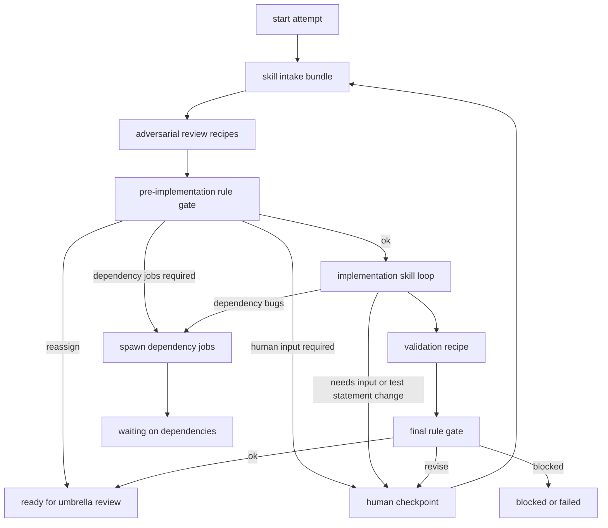

# Skill-First New Ticket Proposal

## Purpose

This proposal sketches a cleaner `new-ticket` model that moves most heuristic
work into skills and keeps recipes focused on durable orchestration, hard policy
checks, human checkpoints, dependency fanout, validation, and merge authority.

The current `new-ticket` family is already moving in this direction: triage,
requirements, implementation planning, outcome determination, contrarian review,
and implementation all use skill-backed Codex calls. The complexity is that the
recipe DAG still owns the choreography for every heuristic step, every review
step, most artifact plumbing, and much of the prompt contract.

The target shape is:

- Skills decide and author heuristic artifacts.
- Recipes perform adversarial counterpointing by launching reviewer recipes.
- Recipe rules make final blocking decisions.
- The primary ticket recipe remains a durable lifecycle supervisor, not a large
  prompt-routing tree.

Important current-state constraint: c2ops `codex` supports enforcing a top-level
skill for one Codex invocation and resuming that invocation with `sessionId`.
It does not give a skill first-class control over clean subagent creation or
durable internal fanout. For C2, adversarial review should therefore be modeled
as recipe fanout: each reviewer recipe gets its own op context, artifacts,
outputs, failure handling, and job-story record.

## Current Friction

`recipes/new-ticket/new-ticket.yaml` is a state machine that calls several child recipes:

- `new-ticket-triage`
- `new-ticket-requirements-planning`
- `new-ticket-implementation-planning`
- `new-ticket-outcome-determination`
- `job-validate`
- merge and cancellation states

Each planning child has the same general pattern:

1. Load cells with `c2j cells --json`.
2. Prepare feedback or fallback artifacts.
3. Invoke a specific skill with c2ops `codex`.
4. Invoke a contrarian skill.
5. Export selected fields from JSON.

That gives good artifact boundaries, but it makes the recipe encode many details
that are better owned by skill contracts:

- which heuristic checks to run;
- which reviewer skill should counterpoint the authoring skill;
- how to summarize and structure each phase artifact;
- which prior artifacts and feedback should be read;
- how repeated planning/review phases should compose.

The recipe should not need to know every heuristic review edge. It should know
which artifacts and policy gates are required before implementation or merge.

## Design Principle

Use a hard separation between heuristic work and policy enforcement.

| Layer | Owns | Examples |
| --- | --- | --- |
| Skill | Judgment, drafting, critique, exploration | Cell triage, requirements, implementation plan, test statement curation, compatibility concerns, risk review |
| Reviewer recipe | Independent adversarial pass | Requirements contrarian review, compatibility review, security review, outcome/test-statement review |
| Recipe rule | Deterministic blocking checks | JSON schema validity, artifact presence, cell ownership, validation exit status, dependency completion, merge approval |
| Recipe state | Durable lifecycle | Start attempt, checkpoint for human input, spawn dependency jobs, await or inspect children, validate, merge, cancel |

Skills can recommend. Recipe rules decide whether a recommendation is allowed to
advance.

## Simplification Strategy

Yes, this can get to a materially simpler state, but only if the recipe stops
modeling every heuristic concern as its own top-level state transition. The
simplified system should make the parent recipe read like a lifecycle, not like
a prompt graph.

The target parent flow should be close to:

```text
start attempt -> inspect result -> merge / restart / complete / cancel
```

The target attempt flow should be close to:

```text
intake bundle -> adversarial review recipes -> rule gate -> implementation loop
-> validation -> final rule gate -> ready for umbrella review
```

That still preserves the important checkpoints, but it hides low-level
heuristic detail behind artifact contracts and reviewer recipes.

Additional simplifications worth applying:

- Collapse triage, requirements, implementation planning, and outcome
  determination into one intake bundle from the parent recipe's perspective.
- Keep adversarial work as separate reviewer recipes, but aggregate their
  outputs into one `reviews/review-pack.json`.
- Replace branching directly on every skill output with a deterministic gate
  that emits `ok`, `next_action`, `blocking_issues`, and `warnings`.
- Move final merge authority out of attempt jobs and into the umbrella job.
- Treat implementation pauses as typed statuses instead of separate bespoke
  route shapes.
- Preserve compatibility outputs temporarily, then delete them once the new
  attempt/umbrella contract is stable.

The key measure of success is not fewer files. It is fewer lifecycle states in
the main recipe, fewer repeated artifact bindings, fewer inline CEL/JQ
transformations, and clearer ownership of each decision.

## Proposed Recipe Set

### `default.yaml`

The existing `DEFAULT_UMBRELLA_JOB_MODEL.md` is the right outer shape. Keep the
primary ticket job as an umbrella:

- capture original ticket prompt and submitted artifacts;
- start one or more attempt jobs;
- inspect attempt results as data;
- select a candidate;
- run final merge or complete without merge;
- cancel explicitly.

The umbrella should not perform planning or implementation directly.

### `new-ticket-attempt.yaml`

Replace the current large `new-ticket` flow with a smaller attempt recipe. It
stops before final upstream merge and returns a typed attempt result.

High-level flow:



Attempt outputs:

```json
{
  "status": "ready_for_review",
  "candidate_hash": "local git hash when present",
  "validation_passed": true,
  "validation_summary": "short summary",
  "reassigned_cell": "",
  "pending_dependencies": [],
  "blocking_issues": [],
  "artifact_bundle": {
    "intake": "ticket/intake.json",
    "requirements": "requirements/plan.json",
    "implementation": "implementation/plan.json",
    "outcome": "outcome/plan.json",
    "reviews": "reviews/review-pack.json"
  },
  "restart_points": ["requirements", "implementation", "validation"]
}
```

### `ticket-intake.yaml`

This can start as a child recipe and later collapse into one `skill.run` call.
It owns the authoring bundle:

- cell triage;
- requirements;
- implementation plan;
- outcome/test statement plan;
- validation command proposal;
- dependency job specs.

It should write the same artifacts the current child recipes write so migration
does not need to change every downstream consumer at once:

- `triage/latest-status.json`
- `requirements/plan.json`
- `requirements/index.md`
- `implementation/plan.json`
- `implementation/index.md`
- `outcome/plan.json`
- `outcome/tests-index.md`
- `outcome/validation-commands.txt`
- `.c2/tests/*.md` when test statements need to be created or updated

The current discrete skills can remain separate internally:

- `c2-triage-cell-boundary`
- `c2-requirements-author`
- `c2-implementation-plan-author`
- `c2-test-statement-curator`

The key change is that the recipe sees one intake bundle, not four separate
sub-recipe phases.

### `ticket-counterpoint.yaml`

Adversarial review should be modeled as recipe fanout. Reviewer skills define
how to critique an artifact, but recipes launch those critiques as independent
durable steps and aggregate their results.

With current primitives, `ticket-counterpoint.yaml` can be a sequence or state
machine that calls review child recipes such as:

- `ticket-review-requirements.yaml`
- `ticket-review-implementation-compat.yaml`
- `ticket-review-outcome.yaml`
- `ticket-review-security.yaml`
- `ticket-review-infra.yaml`

Each child recipe can use c2ops `codex` with one enforced reviewer skill, but
the isolation boundary is the recipe execution, not an internal skill-managed
subagent. This gives C2 the right durable artifacts, retry semantics, and audit
trail for adversarial work.

Inputs:

- intake artifacts;
- current cell;
- available cells;
- risk hints from the intake skill;
- user feedback, if any.

Outputs:

- `reviews/review-pack.json`
- one markdown review per reviewer recipe;
- normalized blocking issue list.

Suggested review result shape:

```json
{
  "ok": false,
  "reviewers": [
    {
      "recipe": "ticket-review-requirements",
      "skill": "c2-requirements-contrarian-review",
      "ok": true,
      "blocking_issues": []
    },
    {
      "recipe": "ticket-review-implementation-compat",
      "skill": "c2-implementation-compat-review",
      "ok": false,
      "blocking_issues": ["Dependency order omits REQ-2."]
    }
  ],
  "blocking_issues": [
    {
      "source_recipe": "ticket-review-implementation-compat",
      "source_skill": "c2-implementation-compat-review",
      "severity": "blocking",
      "message": "Dependency order omits REQ-2.",
      "artifact": "implementation/plan.json"
    }
  ]
}
```

The counterpoint recipe may choose reviewers heuristically. For example:

- API changes present: run API compatibility review.
- Cross-cell dependencies present: run dependency sequencing review.
- Test statements changed: run outcome/test statement review.
- Infrastructure files touched or planned: run infrastructure risk review.
- Security-sensitive scope detected: run security review.

The pre-implementation gate should not care how reviewers were selected. It
should care whether the normalized review pack contains blocking issues.

### `ticket-rule-gate.yaml`

This recipe or op evaluates deterministic gates. It is the replacement for many
current DAG edges that branch directly on skill output.

Pre-implementation gate examples:

- required artifacts exist;
- JSON artifacts parse and satisfy schemas;
- `recommended_cell` is either current cell or a known cell;
- if `cell_is_appropriate=false`, the attempt exits with a reassign result;
- requirement IDs are unique;
- dependency order references only known requirement IDs;
- dependency job specs target known non-current cells;
- review pack contains no blocking issues;
- outcome plan names `.c2/tests/*.md` as the authoritative test statement
  location;
- planning stages did not modify source files outside allowed paths.

Final gate examples:

- implementation skill status is `ready_for_validation`;
- validation passed, or a structured waiver exists;
- candidate hash is non-empty when merge is requested;
- git diff stays inside the current cell;
- implementation did not edit `.c2/tests/*.md` unless routed through outcome
  determination;
- no unresolved dependency jobs remain;
- no blocking review issues remain;
- human approval exists when policy requires it.

Rule gate output:

```json
{
  "ok": false,
  "next_action": "human_checkpoint",
  "blocking_issues": [
    {
      "rule": "review_pack_no_blockers",
      "message": "Compatibility review has blocking issues.",
      "artifact": "reviews/review-pack.json"
    }
  ],
  "warnings": []
}
```

## Skill Contracts

The skills should carry the detail currently repeated in recipes.

### Intake Skill Contract

The intake skill or skill chain should:

- read submitted artifacts from the op inbox;
- read current cell and available cells;
- write triage, requirements, implementation, and outcome artifacts;
- write `.c2/tests/*.md` only during the outcome/test statement part;
- never modify source code;
- produce a normalized `ticket/intake.json` index that points to every artifact.

### Reviewer Skill Contract

Reviewer skills should:

- read only the artifacts they are reviewing;
- write both machine JSON and markdown;
- return a normalized `ok`, `feedback`, and `blocking_issues` shape;
- avoid rewriting the authoring artifacts directly.

The reviewer recipe, not the reviewer skill, is responsible for process
isolation, artifact binding, retry/failure handling, and publishing the review
result into the C2 job story.

### Implementation Skill Contract

The existing `c2-implementation-loop` contract should remain. It is already a
good fit for a skill-first model because it uses `return_on` and
`implementation/latest-status.json`.

The attempt recipe should treat implementation outcomes as data:

- `ready_for_validation`: continue to validation;
- `needs_user_input`: checkpoint;
- `needs_test_statement_update`: route back to intake/outcome;
- `needs_dependency_jobs`: spawn dependency jobs;
- `blocked`: checkpoint or failed attempt.

## Missing c2j Or c2ops Features

The model can be prototyped with current c2ops `codex` plus `command_execution`,
but a few features would make it clean enough to author and maintain.

### 1. First-Class `skill.run`

Current recipes repeat this block constantly:

- c2ops selector;
- worktree/workdir/inbox/outbox paths;
- skill bundle refs;
- `skill_mode: enforce`;
- prompt boilerplate;
- status contract;
- output schema parsing.

Proposed surface:

```yaml
- id: intake
  op: skill.run
  inputs:
    skill: c2-ticket-intake
    bundle: c2-default-skills
    prompt: "{{ inputs.prompt }}"
    artifacts:
      submitted/: "${{ context.artifacts }}"
    output_schema: schemas/ticket-intake.schema.json
    status_contract:
      path: ticket/latest-status.json
```

`skill.run` can still be implemented by c2ops `codex`; the value is a stable,
compact recipe interface.

### 2. `child_group` For Reviewer Recipes

Adversarial work should be easy to express as a durable child recipe group. The
missing ergonomic feature is not a skill-internal subagent API; it is a compact
way for a recipe to run several child review recipes, wait for them, tolerate
selected reviewer failures as data, and aggregate normalized outputs into a
review pack.

Proposed surface:

```yaml
counterpoint:
  child_group:
    mode: run_and_get_result
    children:
      - key: requirements
        recipe: ticket-review-requirements
        required: true
      - key: compatibility
        recipe: ticket-review-implementation-compat
        required: true
      - key: outcome
        recipe: ticket-review-outcome
        when: "${{ artifacts_changed('.c2/tests/*.md') }}"
      - key: security
        recipe: ticket-review-security
        when: "${{ json_parse(artifacts['ticket/intake.json']).risk.security_sensitive }}"
    aggregate:
      shape: review_pack
      artifact: reviews/review-pack.json
```

Important behavior:

- each reviewer runs as a child recipe with its own op contexts and artifacts;
- results are normalized;
- reviewer failures are represented as data when possible;
- required reviewer failures block the gate unless explicitly waived;
- optional reviewer failures can become warnings;
- the parent gets one review pack artifact and one typed output.

This can be prototyped today with explicit `recipe.run_and_get_result` nodes.
The feature request is about removing repetitive YAML, not moving adversarial
control into skills.

### 3. Declarative `rule_gate`

Recipe gates should be data, not shell scripts or long CEL fragments embedded in
state transitions.

Proposed surface:

```yaml
- id: final_gate
  op: rule_gate
  inputs:
    rules:
      - id: validation_passed
        severity: blocking
        assert: "${{ states.validate.outputs.passed }}"
        message: "Validation must pass before merge."
      - id: no_review_blockers
        severity: blocking
        assert: "${{ size(json_parse(artifacts['reviews/review-pack.json']).blocking_issues) == 0 }}"
        message: "Blocking review issues must be resolved."
```

Rule types worth supporting:

- CEL assertions;
- JSON Schema validation for artifacts;
- artifact existence;
- git diff path allow/deny lists;
- command exit status checks;
- child job status checks.

### 4. Artifact Bundle Aliases

The recipes have a lot of repetitive artifact mapping. A bundle alias would make
phase handoff clearer.

Proposed surface:

```yaml
artifacts:
  use:
    - submitted
    - ticket-intake
    - review-pack
```

or:

```yaml
artifact_bundles:
  ticket-intake:
    - requirements/**
    - implementation/**
    - outcome/**
    - .c2/tests/*.md
```

### 5. `child_group` For Dependency Jobs

Current dependency fanout uses inline `jq` to transform plan JSON into
`recipes.run` inputs. That logic is hard to read and test.

Proposed surface:

```yaml
spawn_dependency_jobs:
  child_group:
    mode: start
    children_from: "${{ json_parse(states.implementation.outputs.plan_json).dependency_job_specs }}"
    child:
      key: "${{ item.id }}"
      recipe: new-ticket-attempt
      cell_name: "${{ item.target_cell }}"
      required: true
      inputs:
        prompt: "${{ item.scope }}"
    aggregate:
      shape: job_ids
```

This should validate target cells, preserve parent job metadata, and expose
child job IDs as typed outputs.

### 6. Soft Child Status And Catch

The umbrella model needs child failure as data. Existing node-level `catch:`
can route hard child-await failures, but a soft child-status path is still useful
when the parent should inspect failed child outputs, artifacts, and status as
ordinary data.

Recommended surfaces:

- `recipe.await_result_soft`;
- hard await plus existing node-level `catch:` for workflows that prefer failure
  routing over status-as-data.

Without this, a failed attempt can still fail the supervisor instead of routing
to a restart or human checkpoint.

### 7. Git Diff Rule Helpers

Final gates need stable predicates for common cell-policy checks:

- files changed under current cell only;
- no source changes during planning stages;
- no `.c2/tests/*.md` changes during implementation;
- no forbidden generated artifacts committed.

These can be exposed through `rule_gate` or standalone CEL helpers.

## Highest-Leverage Missing Features

The feature set above is useful, but not all of it is equally important. The
minimum set that would noticeably simplify recipes is:

1. `skill.run`

   Removes repeated c2ops `codex` boilerplate, path plumbing, skill bundle refs,
   status contract setup, and assistant-summary parsing. This is the largest
   source of repeated YAML in the skill-backed recipes.

2. `rule_gate`

   Moves deterministic advancement policy out of ad hoc transitions and shell
   glue. It should support artifact presence checks, JSON Schema checks, CEL
   assertions, git diff constraints, and normalized `next_action` output.

3. Artifact bundle aliases

   Replaces repeated `requirements/plan.json`, `implementation/plan.json`,
   `outcome/plan.json`, and submitted-artifact mappings with named bundles such
   as `ticket-intake`, `review-pack`, and `validation-results`.

4. Soft child status

   Lets the umbrella treat failed attempts and failed reviewer recipes as data.
   Without this, durable supervision still risks collapsing back into brittle
   parent-child failure behavior.

5. `child_group`

   Replaces inline `jq` fanout and repeated child recipe calls for dependency
   jobs and adversarial review with a durable child recipe group that exposes
   `ok`, `child_job_ids`, summaries, warnings, and blocking issues directly.

Everything else is secondary. In particular, skill-internal subagent management
is not required for this design. C2 gets cleaner semantics by keeping
adversarial independence at the recipe layer.

Detailed requirement docs:

- [REQUIREMENTS_SKILL_RUN_OP.md](new-ticket-simplification/REQUIREMENTS_SKILL_RUN_OP.md)
- [REQUIREMENTS_RULE_GATE_OP.md](new-ticket-simplification/REQUIREMENTS_RULE_GATE_OP.md)
- [REQUIREMENTS_ARTIFACT_BUNDLE_ALIASES.md](new-ticket-simplification/REQUIREMENTS_ARTIFACT_BUNDLE_ALIASES.md)
- [REQUIREMENTS_SOFT_CHILD_STATUS.md](new-ticket-simplification/REQUIREMENTS_SOFT_CHILD_STATUS.md)
- [DYNAMIC_CHILD_WORK_RECOMMENDATION.md](DYNAMIC_CHILD_WORK_RECOMMENDATION.md)
- [REQUIREMENTS_CHILD_GROUP_NODE.md](new-ticket-simplification/REQUIREMENTS_CHILD_GROUP_NODE.md)
- [REQUIREMENTS_GIT_DIFF_RULE_HELPERS.md](new-ticket-simplification/REQUIREMENTS_GIT_DIFF_RULE_HELPERS.md)

Exploratory background docs, not primary requirements:

- [REQUIREMENTS_RECIPE_FANOUT_HELPERS.md](REQUIREMENTS_RECIPE_FANOUT_HELPERS.md)
- [REQUIREMENTS_FOREACH_NODE.md](REQUIREMENTS_FOREACH_NODE.md)

## Core Versus Extension Boundary

Some requests need recipe-engine support. Others can be delivered as normal
selector-backed extension ops in c2ops.

| Feature | Likely home | Why |
| --- | --- | --- |
| `skill.run` | c2ops extension op | It wraps c2ops `codex`, consumes explicit inputs/artifacts, validates status/output contracts, and emits JSON. c2j core is not required unless we want a built-in alias. |
| `rule_gate` | c2ops extension op first | A gate can consume rendered booleans, materialized artifacts, JSON schemas, and git paths as explicit inputs. It can become core later only if we want first-class recipe syntax or direct access to unmaterialized artifact refs. |
| Artifact bundle aliases | c2j core | Bundles change recipe artifact binding, scope resolution, validation, expansion, and job-story display before an op starts. Extension ops cannot remove repeated `artifacts:` maps by themselves. |
| Soft child status | c2j core / built-in op | Child jobs are recipe-runtime objects. Soft status must preserve embedded/server semantics, hard-await compatibility, job-story links, and interaction with existing `catch:`. |
| `child_group` | c2j core / built-in recipe node | Launching child recipes, preserving child job IDs, applying required/optional semantics, and aggregating child outputs are recipe-runtime behavior. First version should support start-only and wait-for-all/result-all, not wait-for-any monitoring or fail-fast. |
| Git diff rule helpers | c2ops extension op, or `rule_gate` plugin | Git checks can run against the op worktree from explicit base/head/path inputs. Core is only needed for a CEL helper or a built-in preset that directly understands c2 git state. |

Practical implementation order:

1. Build `skill.run`, `rule_gate`, and git diff checks in c2ops first.
2. Add artifact bundles and soft child status in c2j core.
3. Prototype `child_group` using explicit reviewer/dependency recipes where
   possible, then add the built-in node once the output shape is proven.

## Migration Plan

### Phase 1: Consolidate Planning Behind One Bundle

Create `ticket-intake.yaml` using current c2ops `codex` skill calls. Keep the
same artifacts and output fields as the current planning recipes.

This reduces the parent `new-ticket` DAG without requiring new runtime features.

### Phase 2: Add A Rule Gate

Prototype `ticket-rule-gate.yaml` with `command_execution` and JSON files. Keep
the rules explicit in a checked-in YAML or JSON file so the gate is reviewable.

Use it first for pre-implementation checks:

- artifact existence;
- JSON parse and schema checks;
- review pack blockers;
- dependency job spec validity.

### Phase 3: Introduce `new-ticket-attempt.yaml`

Move final merge authority out of the attempt. The attempt should end with
`ready_for_review`, `blocked`, `needs_user_input`, `waiting_on_dependencies`, or
`reassigned`.

Keep `job-validate` and the current `c2-implementation-loop` skill.

### Phase 4: Add The Umbrella

Use the model in `DEFAULT_UMBRELLA_JOB_MODEL.md`:

- start attempts;
- inspect attempt status;
- restart attempts from durable artifacts;
- choose a candidate;
- merge, complete, or cancel.

### Phase 5: Replace Glue With c2j Features

After the prototype proves the lifecycle, add `skill.run`, `child_group`,
`rule_gate`, artifact bundles, and soft child status. Then remove the temporary
command glue.

## What Gets Simpler

The parent recipe no longer needs separate states for each heuristic phase and
review pair. It only routes on durable outcomes:

- reassign;
- needs human input;
- dependency jobs required;
- ready for implementation;
- ready for validation;
- ready for umbrella review;
- blocked or cancelled.

The skill layer can evolve without changing the recipe DAG every time a new
reviewer, heuristic, or artifact detail is added.

## Risks And Guardrails

Risk: skill sessions become too broad and less auditable.

Guardrail: require each skill phase to write a status JSON, markdown summary,
and index artifact. The job story should reference those artifacts.

Risk: adversarial review loses independence if it runs inside one skill session.

Guardrail: reviewer independence must be enforced by reviewer recipes. Use a
shared normalized result format and artifact pack, not shared reviewer memory.

Risk: recipe rules become another scripting layer.

Guardrail: keep gates declarative. Prefer CEL assertions, JSON Schema, artifact
existence checks, and built-in git diff predicates over arbitrary scripts.

Risk: a skill recommends an unsafe path and the recipe accepts it.

Guardrail: only rule gates advance the workflow. Skills can produce
recommendations and blocking issues, but final advancement comes from explicit
policy checks.

## Recommended First Cut

Build a prototype with existing primitives:

1. Add `ticket-intake.yaml` that wraps the current triage, requirements,
   implementation-plan, and outcome skills behind one child recipe.
2. Add `ticket-counterpoint.yaml` that calls discrete reviewer recipes and emits
   one normalized `reviews/review-pack.json`.
3. Add `ticket-rule-gate.yaml` using `command_execution` for deterministic
   artifact and schema checks.
4. Create `new-ticket-attempt.yaml` that calls those three recipes, then the
   existing `c2-implementation-loop`, then `job-validate`, then the final gate.
5. Keep `recipes/new-ticket/new-ticket.yaml` intact until the attempt recipe can satisfy the
   existing recipe tests with equivalent outputs.

This gets the recipe tree cleaner immediately while preserving the current
skill investment and artifact contracts.
